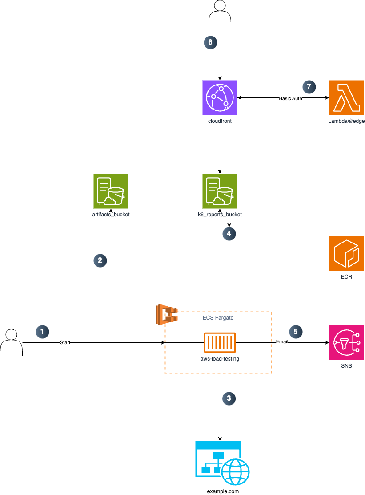

# README #

This project provides an AWS-based solution for load testing using ECS and [Grafana K6](https://k6.io/docs/). It leverages a `Makefile` for automation, making deployment, testing, and container management straightforward.

## Diagram



Load test scripts are stored into an S3 bucket (ARTIFACTS_BUCKET). When the user runs a load test (1), the container that runs on an ECS task, download the script (2) from the bucket and runs the against the URL (3), passeed through environment variable at execution time.

Upon completition, load testing results are uploaded to an s3 bucket (4) (REPORTS_BUCKET) behind a Cloudfront distribution to serve reports via a public URL (6) protected by basic auth provided by Lambda@edge (7).

An SNS notification (5) will inform the user the end of the test with the URL where is it possible to review the results.

## Deploy

### Prerequisites

## Prerequisites
- **AWS Account**: Set up and configure the AWS CLI.
- **Docker**: To build and push containers.
- **Hadolint**: A Docker file linter (https://github.com/hadolint/hadolint)
- **Terraform**: For deploying infrastructure.
- **ECS Cluster**: Where the load testing will be deployed to.

## Setup

### Clone the Repository
```bash
git clone https://github.com/yredeployAB/aws-solution-load-testing.git
cd aws-solution-load-testing
```

### Create and activate Python Virtual Environment
```bash
python -m venv venv
. ./venv/bin/activate
```

### Install requirements
```bash
pip install -r requirements.txt
```

### Configure AWS Credentials
Ensure your AWS CLI is configured with appropriate access:

```bash
aws configure
```

Configure AWS environment variables:
```bash
export AWS_REGION=<region>
export AWS_PROFILE=<profile>
```

### Setup Target Application
In `configs/` copy or rename `app/environment` to your application and environment prefernces (see [README.md](configs/README.md)).

You can have as many application and environment you want. You will refer to these with `TARGET_APP` and `TARGET_ENV` when running load testing from the Makefile.

## Usage

### Deploy Infrastructure
Deploy the required AWS infrastructure using Terraform:

```bash
make tf.plan
make tf.apply
```

Once the infrastructure is created create `core/docker/.env` with the values from the terrafoorm output (see `core/docker/env.example` for reference).

### Build and Push Docker Images
Build and push the Docker container:

```bash
make docker.build
make docker.login
make docker.push
```

### Copy K6 Scripts to the bucket
Copy k6 scripts from `configs/<application>/<environment>` to the artifact bucket.

```bash
ARTIFACTS_BUCKET="<artifacts_bucket>" make artifacts.copy
```

### Copy Assets to the bucket
Copy assets to the assets bucket.
Assets are just static html pages that will serve you reports.

`index.html` is generated automatically when you upload to the bucket using Jinjia template.
It shows the list of reports generated in a tree folder structure.

```bash
REPORTS_BUCCKET="<artifacts_bucket>" REPORTS_URL="<url>" make assets.copy
```

### Run K6 Tests
Execute the K6 scripts for different test types:

```bash
TARGET_APP=app1 TARGET_ENV=dev make load.run
```
Once the load test is completed, it will send a notification through SNS to your email.

### Clean Up
Destroy the deployed AWS infrastructure:

```bash
make destroy
```

## Makefile Commands
Here’s an overview of the `Makefile` commands for reference:
- `pre-commit`: Run pre-commit hooks manually
- `tf.lint.fmt`: Validate terraform and running terraform fmt
- `lint.tf`: Run tflint
- `lint`: Run lint terraform code
- `tf.init`: Initialize terraform state backend and providers
- `tf.plan`: Runs a terraform plan
- `tf.apply`: Applies a planned state.
- `tf.destroy`: Destroy resources created by terraform.
- `tf.doc`: Generate terraform documentation
- `docker.build`: Build the docker image in service
- `docker.login`: Login to ECR
- `docker.push`: Push an image to ECR
- `artifacts.copy`: Copy K6 scripts to the Artifact bucket
- `assets.copy`: Copy assets to the k6 reports web bucket
- `load.run`: Run the load testing
- `help`: Prints this help message

## Features
- **Automated Testing**: Run tests using `Makefile` commands for convenience.
- **Load Testing**: Simulate steady traffic to evaluate system performance.
- **Spike Testing**: Assess system behavior under sudden traffic spikes.
- **Stress Testing**: Push the system to its limits to find bottlenecks.
- **Soak Testing**: Sustain traffic for long durations to ensure stability.

## Troubleshooting
- **Terraform Errors**: Run `terraform validate` manually to debug configuration issues.
- **K6 Script Errors**: Verify the `URL` environment variable is set correctly.
- **Docker Issues**: Ensure the Docker daemon is running and check the `Dockerfile`.

## License
This project is licensed under the MIT License. See the [LICENSE](LICENSE) file for details.

## Resources
- [Grafana K6 Documentation](https://grafana.com/docs/k6/)
- [Terraform Documentation](https://developer.hashicorp.com/terraform/docs)
- [AWS CLI Documentation](https://docs.aws.amazon.com/cli/latest/userguide/cli-chap-welcome.html)
